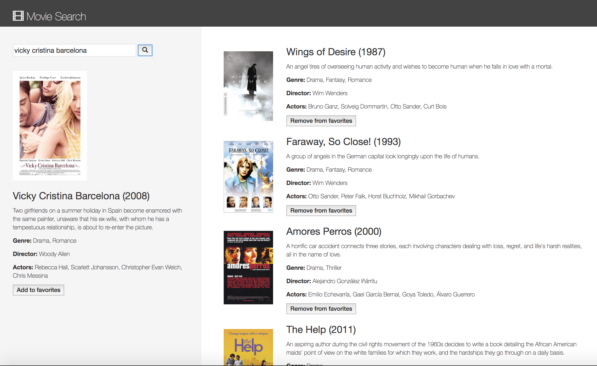

# Weekend Challenge 5 - Movie Search (Angular, MongoDB, OMDB API)

## Requirements
For this challenge, you will be working with Angular and the OMDB API to build an application that can search movies, and then a user can store their favorites!

**Base Mode**
Your application will need to be built from the ground up using Angular, Node, Express, and Bootstrap. The requirements of the application are:

- There should be two views to the application, one side that searches and displays movie information made available from OMDB. This should be accomplished by having an entry field for the search string, then a submit button that sends the information to OMDB.

- When the API returns the response, the response should be data bound between an object and the response so that the search information appears as soon as the response returns from the API.

- You MUST use an Angular factory to send the API call ($http).

- The information that is returned from the API will be a movie object. You must display some of the movie information on the DOM in a meaningful way. Additionally, you must have an 'add to favorites' button on those results.

- When the 'add to favorites' button is clicked, it should record the information for the movie and store it into an array of favorites.

- The other view should display the favorite movies selected by the user.

**Hard Mode**
When a favorite is added to the favorites list, store the favorites list in a Mongo Database.

**Pro Mode**
Add the ability to remove a movie from the Mongo Database, and ensure that the favorites view updates as well.

**Master Mode**
Host the application on Heroku and mLabs. No need to do a data dump of an existing database.

## Setup
1. Clone the repo to your computer using `git clone https://github.com/claudiacalderas/movie-search.git`
2. Run `npm install`
3. Run `grunt`
4. Ensure Mongo is running `mongod`
5. If running the app locally, make sure mongoURI is pointing to the localhost database : `var mongoURI = 'mongodb://localhost:27017/movieDB';` mongoURI is defined in /server/modules/db.js

## Screenshot

